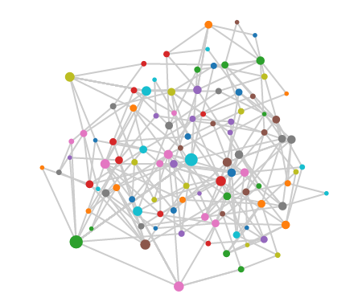

100 Pirates
-----------
After seeding with two random friends GraphML rendered using yFiles

After chatting and making new friends rendered using graphJSON and D3

[Run this simulation in your browser](http://simianviz.surge.sh/fsm)

Spigo uses a common message protocol called Gotocol which contains a channel of the same type. This allows message listener endpoints to be passed around to dynamically create an arbitrary interconnection network.

Using terminology from Promise Theory each message also has an Imposition code that tells the receiver how to interpret it, and an Intention body string that can be used as a simple string, or to encode a more complex structured type or a Promise.

There is a central controller, the FSM (Flexible Simulation Manager or [Flying Spaghetti Monster](http://www.venganza.org/about/)), and a number of independent Pirates who listen to the FSM and to each other.

Current implementation creates the FSM and a default of 100 pirates, which can be set on the command line with -p=100. The FSM sends a Hello PirateNN message to name them which includes the FSM listener channel for back-chat. FSM then iterates through the pirates, telling each of them about two of their buddies at random to seed the network, giving them a random initial amount of gold coins, and telling them to start chatting to each other at a random pirate specific interval of between 0.1 and 10 seconds.

FSM can also reload from a json file that describes the nodes and edges in the network.

Either way FSM sleeps for a number of seconds then sends a Goodbye message to each. The Pirate responds to messages until it's told to chat, then it also wakes up at intervals and either tells one of its buddies about another one, or passes some of it's gold to a buddy until it gets a Goodbye message, then it quits and confirms by sending a Goodbye message back to the FSM. FSM counts down until all the Pirates have quit then exits.

The effect is that a complex randomized social graph is generated, with density increasing over time. This can then be used to experiment with trading, gossip and viral algorithms, and individual Pirates can make and break promises to introduce failure modes. Each pirate gets a random number of gold coins to start with, and can send them to buddies, and remember which benefactor buddy gave them how much.

Simulation is logged to a file spigo.graphml with the -g command line option or <arch>.json with the -j option. Inform messages are sent to a logger service from the pirates, which serializes writes to the file. The graphml format includes XML gibberish header followed by definitions of the node names and the edges that have formed between them. Graphml can be visualized using the yEd tool from yFiles. The graphJSON format is simpler and Javascript code to render it using D3 is in spigo.html.

There is a test program that exercises the Namedrop message, this is where the FSM or a Pirate passes on the name of a third party, and each Pirate builds up a buddy list of names and the listener channel for each buddy. Another test program tests the type conversions for JSON readings and writing.
