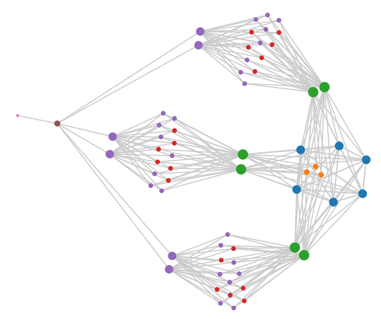

## Architecture definition files

Suitable for fairly large scale simulations, spigo runs well up to 100,000 independent nanoservice actors in a few GB of RAM. Three types of architectural models are implemented. One creates a peer to peer social network (fsm and pirates). Most others are based on a LAMP stack or NetflixOSS microservices in a more tree structured model loaded from an architecture definition file. The migration architecture is hard coded, starts with LAMP and ends with NetflixOSS.

Each nanoservice actor is created as a goroutine with dynamically allocated go channels simulating networks and a common "gotocol" that simulates HTTP and routing mechanisms. The resulting graph can be saved using the GraphML standard or rendered by saving to a custom graph json format and viewing in a web browser via D3.

A few lines of code or a simple json definition file can be used to create an interesting architecture. See json/netflixoss_arch.json (shown below) to see how to define an architecture. If you figure out your own architecture in the form shown below it's going to be easy to carry forward as Spigo evolves.


```
$ more json_arch/netflixoss*
{
    "arch": "netflixoss",
    "description":"A very simple Netflix service. See http://netflix.github.io/ to decode the package names",
    "version": "arch-0.0",
    "victim": "homepage",
    "services": [
        { "name": "cassSubscriber",   "package": "priamCassandra", "count": 6, "regions": 1, "dependencies": ["cassSubscriber", "eureka"]},
        { "name": "evcacheSubscriber","package": "store",          "count": 3, "regions": 1, "dependencies": []},
        { "name": "subscriber",       "package": "staash",         "count": 6, "regions": 1, "dependencies": ["cassSubscriber", "evcacheSubscriber"]},
        { "name": "login",            "package": "karyon",        "count": 18, "regions": 1, "dependencies": ["subscriber"]},
        { "name": "homepage",         "package": "karyon",        "count": 24, "regions": 1, "dependencies": ["subscriber"]},
        { "name": "wwwproxy",         "package": "zuul",           "count": 6, "regions": 1, "dependencies": ["login", "homepage"]},
        { "name": "www-elb",          "package": "elb",            "count": 0, "regions": 1, "dependencies": ["wwwproxy"]},
        { "name": "www",              "package": "denominator",    "count": 0, "regions": 0, "dependencies": ["www-elb"]}
    ]
}

```

For a single unscaled region, the above architecture is processed using spigo to produce json/netflixoss.json which is rendered using the single page app linked above or via a simpler local page local-d3-simianviz.html which can be used offline for quick tests with a local copy of d3.

```
$ ./spigo -d 2 -j -a netflixoss
2016/04/20 11:35:16 Loading architecture from json_arch/netflixoss_arch.json
2016/04/20 11:35:16 netflixoss.edda: starting
2016/04/20 11:35:16 Architecture: netflixoss A very simple Netflix service. See http://netflix.github.io/ to decode the package names
2016/04/20 11:35:16 architecture: scaling to 100%
2016/04/20 11:35:16 Starting: {cassSubscriber     priamCassandra 1 6 [cassSubscriber eureka]}
2016/04/20 11:35:16 netflixoss.us-east-1.zoneA..eureka00...eureka.eureka: starting
2016/04/20 11:35:16 netflixoss.us-east-1.zoneB..eureka01...eureka.eureka: starting
2016/04/20 11:35:16 netflixoss.us-east-1.zoneC..eureka02...eureka.eureka: starting
2016/04/20 11:35:16 Starting: {evcacheSubscriber     store 1 3 []}
2016/04/20 11:35:16 Starting: {subscriber     staash 1 6 [cassSubscriber evcacheSubscriber]}
2016/04/20 11:35:16 Starting: {login     karyon 1 18 [subscriber]}
2016/04/20 11:35:16 Starting: {homepage     karyon 1 24 [subscriber]}
2016/04/20 11:35:16 Starting: {wwwproxy     zuul 1 6 [login homepage]}
2016/04/20 11:35:16 Starting: {www-elb     elb 1 0 [wwwproxy]}
2016/04/20 11:35:16 Starting: {www     denominator 0 0 [www-elb]}
2016/04/20 11:35:16 netflixoss.*.*..www00...www.denominator activity rate  10ms
2016/04/20 11:35:17 chaosmonkey delete: netflixoss.us-east-1.zoneA..homepage15...homepage.karyon
2016/04/20 11:35:18 asgard: Shutdown
2016/04/20 11:35:18 netflixoss.us-east-1.zoneB..eureka01...eureka.eureka: closing
2016/04/20 11:35:18 netflixoss.us-east-1.zoneC..eureka02...eureka.eureka: closing
2016/04/20 11:35:18 netflixoss.us-east-1.zoneA..eureka00...eureka.eureka: closing
2016/04/20 11:35:18 spigo: complete
2016/04/20 11:35:18 netflixoss.edda: closing
```

### Output generated by the above run
The command line used to generate each output file is embedded in the file so it can be regenerated easily.
The graph contains four types of entries, nodes (which are assigned an IP address), edges that connect two nodes, forget edges, and done nodes. Every entry has a timestamp to capture the evolution of the graph.
```
$ more json/netflixoss.json
{
  "arch":"netflixoss",
  "version":"spigo-0.4",
  "args":"[./spigo -d 2 -j -a netflixoss]",
  "date":"2016-04-20T11:35:16.222228559-07:00",
  "graph":[
    {"node":"netflixoss.us-east-1.zoneA.cassSubscriber00","package":"priamCassandra","timestamp":"2016-04-20T11:35:16.222530435-07:00","metadata":"IP/54.198.0.1"},
    {"node":"netflixoss.us-east-1.zoneB.cassSubscriber01","package":"priamCassandra","timestamp":"2016-04-20T11:35:16.22285985-07:00","metadata":"IP/54.221.0.1"},
    {"edge":"e1","source":"netflixoss.us-east-1.zoneB.cassSubscriber01","target":"netflixoss.us-east-1.zoneA.cassSubscriber00","timestamp":"2016-04-20T11:35:16.222940964-07:00"},
    {"node":"netflixoss.us-east-1.zoneC.cassSubscriber02","package":"priamCassandra","timestamp":"2016-04-20T11:35:16.223017362-07:00","metadata":"IP/50.19.0.1"},
    {"edge":"e2","source":"netflixoss.us-east-1.zoneC.cassSubscriber02","target":"netflixoss.us-east-1.zoneA.cassSubscriber00","timestamp":"2016-04-20T11:35:16.223046997-07:00"},
    {"edge":"e3","source":"netflixoss.us-east-1.zoneC.cassSubscriber02","target":"netflixoss.us-east-1.zoneB.cassSubscriber01","timestamp":"2016-04-20T11:35:16.223057829-07:00"},
    {"node":"netflixoss.us-east-1.zoneA.cassSubscriber03","package":"priamCassandra","timestamp":"2016-04-20T11:35:16.22309732-07:00","metadata":"IP/54.198.0.2"},
...
    {"done":"netflixoss.us-east-1.zoneC.homepage08","exit":"normal","timestamp":"2016-04-20T11:35:18.228719924-07:00"},
    {"done":"netflixoss.us-east-1.zoneC.homepage17","exit":"normal","timestamp":"2016-04-20T11:35:18.228725512-07:00"},
    {"done":"netflixoss.us-east-1.zoneC.login14","exit":"normal","timestamp":"2016-04-20T11:35:18.228759577-07:00"},
    {"done":"netflixoss.us-east-1.zoneC.wwwproxy02","exit":"normal","timestamp":"2016-04-20T11:35:18.228765237-07:00"},
    {"done":"netflixoss.us-east-1.zoneC.homepage05","exit":"normal","timestamp":"2016-04-20T11:35:18.228773792-07:00"},
    {"done":"netflixoss.us-east-1.zoneC.login05","exit":"normal","timestamp":"2016-04-20T11:35:18.228778239-07:00"},
    {"done":"netflixoss.us-east-1.zoneC.wwwproxy05","exit":"normal","timestamp":"2016-04-20T11:35:18.228786467-07:00"}
  ]
}
```

### Graphical output visualized via d3
